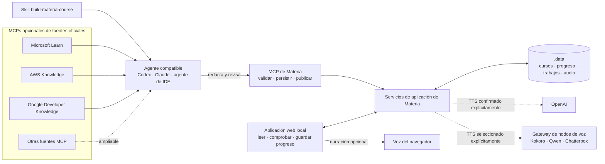

# Materia — guía en español

Materia es una aplicación local-first que convierte material fuente en cursos estructurados y trazables, con audio generado de forma opcional. La interfaz se muestra en inglés por defecto; puedes cambiarla a español desde el selector **EN / ES** sin cambiar el idioma del curso.

## Cómo encaja Materia



Los MCPs de investigación son opcionales y sustituibles: aportan documentación primaria al agente, mientras que la skill incluida define el flujo de autoría y revisión. El agente entrega contenido estructurado mediante el MCP de Materia; Materia lo valida y lo conserva localmente antes de que el estudiante lo lea, compruebe y, si quiere, lo convierta en narración. Las rutas de audio del diagrama son texto a voz, no transcripción desde micrófono.

## Instalación local

Necesitas Git, Node.js 22–24, Corepack y pnpm 11.

```sh
pnpm install --frozen-lockfile --ignore-scripts
cp .env.example .env.local
pnpm run dev
```

En PowerShell usa `Copy-Item .env.example .env.local`. Abre `http://127.0.0.1:3210` y pulsa **Try the sample course** o cambia primero la interfaz a español. La demo funciona sin red, credenciales ni servicios de voz. Este comando usa el servidor de desarrollo con recarga automática; los datos también persisten bajo `.data/`.

## Ejecución local optimizada

```sh
pnpm run build
pnpm run start
```

Este arranque utiliza la compilación standalone optimizada, sin servidor de desarrollo ni recarga automática. Es apropiado para el uso local habitual.

Docker ofrece esa misma aplicación optimizada sin exigir una instalación local de Node.js después de construir la imagen:

```sh
docker compose --env-file .env.local up --build
```

El comando utiliza el mismo `.env.local` creado durante la instalación. Ambas opciones optimizadas escuchan solo en el equipo local por defecto. Para acceder desde otro dispositivo de una red privada de confianza, configura `MATERIA_BIND_ADDRESS=0.0.0.0`. No expongas la aplicación directamente a Internet: no incorpora autenticación. Docker conserva los datos en el volumen `materia-data`; puedes elegir otro nombre mediante `MATERIA_DATA_VOLUME`.

## Idiomas

El idioma de la interfaz y el del contenido son independientes. Los cursos nuevos usan inglés por defecto y pueden crearse en inglés estadounidense, inglés británico o español. Las lecciones anteriores que no guardaban este dato continúan tratándose como españolas. La narración y las voces compatibles siguen siempre el idioma del contenido.

## OpenAI y voz local

Copia `.env.example` a `.env.local`, añade `OPENAI_API_KEY` y reinicia Materia para habilitar la generación directa de lecciones desde texto y la narración TTS de OpenAI. La clave permanece en el servidor y nunca se introduce en el navegador. Si no existe, Materia lo comunica sin fallar y mantiene disponibles la demo y el recorrido mediante agente/MCP. La transcripción desde micrófono todavía no está implementada.

Los motores Kokoro, Qwen y Chatterbox pueden ejecutarse en otro equipo mediante el gateway portable de `services/voice-node`. El servidor se configura con `MATERIA_VOICE_NODES`. No existe fallback automático: elegir un nodo, motor u OpenAI es una autorización concreta.

Consulta la [guía de proveedores](docs/PROVIDERS.md) para el recorrido rápido de OpenAI, Docker y la alternativa avanzada de nodos locales.

## MCP y agentes

Ejecuta `pnpm run mcp` para iniciar el servidor MCP por STDIO. En Codex o ChatGPT para escritorio, añade o abre el clon como proyecto local, confía explícitamente en él y crea una tarea nueva desde su raíz. Así se descubren la configuración MCP del proyecto y la skill `build-materia-course`; `codex mcp list` debe mostrar `materia`. En Codex puedes invocar la skill de forma explícita con `$build-materia-course`.

La configuración también declara Microsoft Learn, AWS Knowledge y Google Developer Knowledge como fuentes opcionales y de solo lectura; Google requiere una clave restringida fuera del repositorio. Otros agentes o IDE compatibles con MCP pueden registrar `pnpm run mcp` como servidor STDIO usando la raíz del clon como directorio de trabajo. Si el cliente admite Agent Skills, puede importar o apuntar a `.agents/skills/build-materia-course`; la sintaxis de descubrimiento y los controles de confianza dependen de cada cliente.

Los datos se guardan bajo `.data/`. Detén la aplicación y copia la carpeta completa para crear una copia de seguridad. No edites manualmente sus JSON.

Consulta el [README principal](README.md) y la [documentación MCP](docs/MCP.md) para instalar, verificar y usar estas fuentes de forma segura.
