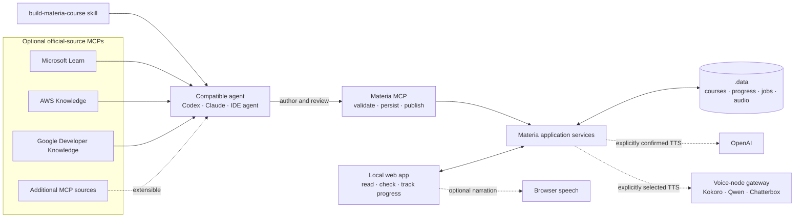

# Materia

Materia is a local-first learning app that turns source material into structured, traceable courses with optional generated audio. It runs without accounts or cloud infrastructure, includes a deterministic offline demo, and keeps provider credentials on the server.

[Guía en español](README.es.md)

## Status

Materia is an early open-source project validated natively on Linux, macOS, and Windows. It is licensed under Apache-2.0 and uses Materia identifiers throughout its runtime and integration contracts.

## How Materia fits together



The research MCPs are optional and replaceable: they give the agent access to primary documentation, while the bundled skill defines the authoring and review workflow. The agent sends structured course content through Materia's MCP; Materia validates and stores it locally before the learner reads, checks, and optionally narrates it. The audio paths above are text-to-speech, not microphone transcription.

## Quick start

Requirements: Git, Node.js 22–24, Corepack, and pnpm 11.

```sh
pnpm install --frozen-lockfile --ignore-scripts
cp .env.example .env.local
pnpm run dev
```

On PowerShell, replace the copy command with `Copy-Item .env.example .env.local`. Open `http://127.0.0.1:3210` and choose **Try the sample course**. The demo is deterministic and needs no credentials, network, or voice service.

This command uses the Next.js development server with automatic reload. It is the shortest path for trying Materia or changing its source; lessons still persist under `.data/`.

## Run the optimized local app

```sh
pnpm run build
pnpm run start
```

This runs the same application from its optimized standalone build, without the development server or automatic reload. It is suitable for regular local use and serves `127.0.0.1:3210` by default.

Docker provides the same optimized application without requiring a local Node.js installation after the image is built:

```sh
docker compose --env-file .env.local up --build
```

The command uses the same `.env.local` created during setup. Both optimized options publish only on loopback by default. To allow access from another trusted device, set `MATERIA_BIND_ADDRESS=0.0.0.0`. Materia has no authentication and must not be exposed directly to the public Internet. Docker stores persistent data in the `materia-data` volume; set `MATERIA_DATA_VOLUME` before starting Compose when an operator-managed volume name is required.

## Language model

The interface defaults to English and can be switched to Spanish with the language control. Interface language and course language are independent:

- new courses default to English content;
- English (US), English (UK), and Spanish course content are supported;
- existing lessons without language metadata remain Spanish for backward compatibility;
- narration, browser speech, and compatible voice-node selection follow the course language, not the interface language.

## Optional providers

Copy `.env.example` to `.env.local`, add `OPENAI_API_KEY`, and restart Materia to enable direct lesson generation from pasted text and optional OpenAI TTS narration. The key stays in the server process and is never entered in the browser. Without it, Materia reports that OpenAI is not configured and continues to work in demo and agent/MCP modes. Microphone transcription is not currently implemented.

Local Kokoro, Qwen, and Chatterbox engines can be exposed through the portable gateway under `services/voice-node`. Configure the server with `MATERIA_VOICE_NODES`. The browser receives capability names and availability but never gateway URLs, tokens, filesystem paths, or reference audio. There is no automatic fallback between paid and local providers.

See [Provider setup](docs/PROVIDERS.md) for the OpenAI quick path, Docker configuration, and the advanced local voice-node alternative.

## Agent and MCP setup

The project MCP server starts over STDIO:

```sh
pnpm run mcp
```

For Codex or ChatGPT desktop, add or open the clone as a local project, trust it, and start a new task from the repository root. The project-scoped MCP configuration and bundled `build-materia-course` skill are then discoverable; `codex mcp list` should include `materia`. Invoke the skill explicitly with `$build-materia-course` in Codex when creating a course.

The project configuration also declares optional read-only research sources for Microsoft Learn, AWS Knowledge, and Google Developer Knowledge; Google requires a separately configured restricted API key. Other MCP-capable agents and IDEs can register the same `pnpm run mcp` STDIO command with this repository as the working directory. Clients that support Agent Skills can import or point to `.agents/skills/build-materia-course`; otherwise its `SKILL.md` remains a portable authoring workflow, but discovery syntax and trust controls depend on the client. See [docs/MCP.md](docs/MCP.md) for setup, verification, supported content-language values, and a generic client contract.

## Quality checks

```sh
pnpm run typecheck
pnpm run lint
pnpm run test
pnpm run build
pnpm run smoke
pnpm audit --audit-level high
```

## Data and safety

Lessons, progress, jobs, and generated audio are stored under `.data/` and survive restarts. Stop Materia and copy the entire directory to create a backup. Do not edit persisted JSON manually. Audio and destructive course operations require explicit confirmation; duplicate and ambiguous remote generation is handled conservatively.

## Scope

Materia currently covers authored courses, source traceability, typed code/diagram/image-reference learning artifacts, progress, assessments, optional TTS, resumable generation jobs, and MCP-assisted course creation. It does not include accounts, payments, analytics, a cloud database, URL crawling, or realtime voice tutoring.

## Documentation

- [Product](docs/PRODUCT.md)
- [Architecture](docs/ARCHITECTURE.md)
- [Provider setup](docs/PROVIDERS.md)
- [MCP](docs/MCP.md)
- [Decisions](docs/DECISIONS.md)
- [Documentation index](docs/INDEX.md)
- [Contributing](CONTRIBUTING.md)
- [Security](SECURITY.md)
- [Changelog](CHANGELOG.md)

Copyright 2026 Hamilton Leguizamon. Licensed under the [Apache License 2.0](LICENSE).
